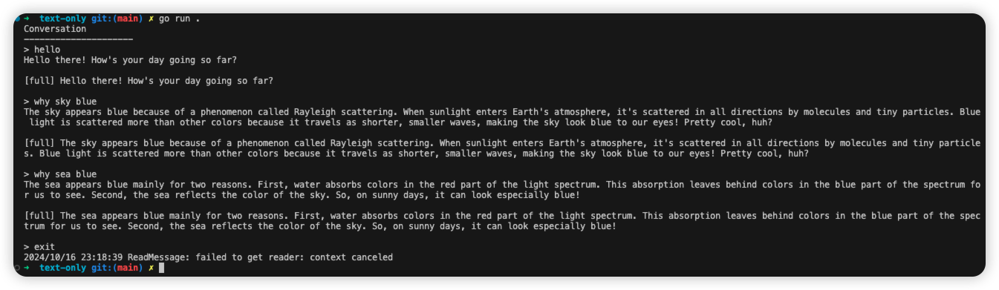

# go-openai-realtime example for text-only

This is a simple example that demonstrates how to use the go-openai-realtime library to create a text-to-text chat program.

## Run

```bash
export OPENAI_API_KEY=<your openai api key>
export SOCKS_PROXY=<your socks proxy> # this optional
go run .
```

Input any text and press enter to send it to the server, then you can see the text response from the server, shown as teletypewriter effect. After that, you can see a line of text prefixed by `[full]`, which is the full response text from the server.

If you want to exit the program, input `exit` and press enter.

Screenshot:


