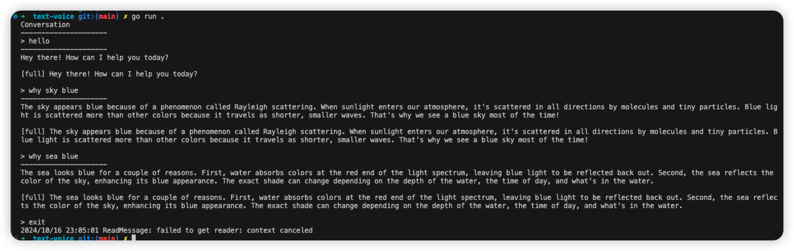

# go-openai-realtime example for voice

This is a simple example that demonstrates how to use the go-openai-realtime library to create a text-to-voice chat program.

## Prerequisite

This example needs portaudio library to play audio, please install it before running this library.

On macOS:
```bash
brew install pkg-config
brew install portaudio
```

On Linux:
```bash
apt-get install portaudio19-dev
```

## Run

```bash
export OPENAI_API_KEY=<your openai api key>
export HTTPS_PROXY=<your socks proxy like: socks5://127.0.0.1:1080> # this optional
go run .
```

Input any text and press enter to send it to the server, then you can hear the voice response from the server. Meanwhile, you can see the text response from the server, shown as teletypewriter effect. After that, you can see a line of text prefixed by `[full]`, which is the full response text from the server.

If you want to exit the program, input `exit` and press enter.

Screenshot:


