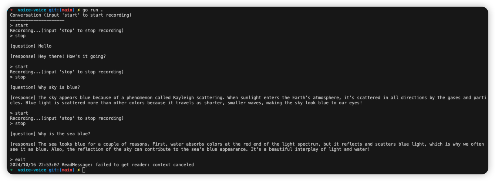

# go-openai-realtime example for voice

This is a simple example that demonstrates how to use the go-openai-realtime library to create a voice-to-voice chat program.

## Prerequisite

This example needs portaudio library to play audio, please install it before running this library.

On macOS:
```bash
brew install pkg-config
brew install portaudio
```

On Linux:
```bash
apt-get install portaudio19-dev
```

## Run

```bash
export OPENAI_API_KEY=<your openai api key>
export SOCKS_PROXY=<your socks proxy> # this optional
go run .
```

Input `start` and press enter to start recording, you can say whatever you want. After you finish speaking, input `stop` and press enter to stop recording. Then a line of text prefixed by `[question]` will be printed, which is the transcription of your voice. Then, a line of text prefixed by `[response]` will be printed, which is the response transcription from the server. Meanwhile, you can hear the audio response from the server.

If you want to exit the program, input `exit` and press enter.

Screenshot:


